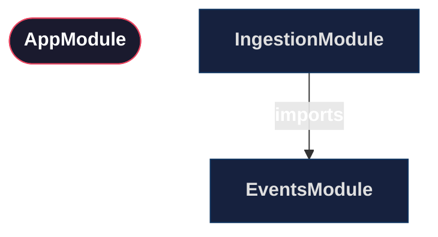
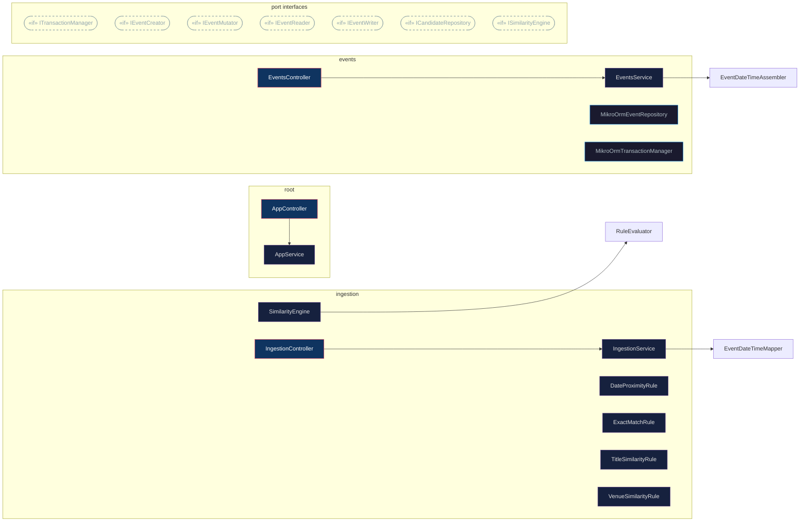

# CampusPulse — Architecture

> Auto-generated by `scripts/generate-arch.mjs` — do not edit by hand.
> Regenerate after any structural change: `pnpm arch`

---

## 1. Module Graph

NestJS module imports. Framework modules (ConfigModule, MikroOrmModule) are omitted.

---

## 2. Dependency Injection Graph

Classes grouped by module. **Solid arrows** are direct class dependencies.
**Dashed arrows** are dependencies injected via a port token.

---

## 3. Layer Diagram

Every component placed in its architectural layer.
Arrows show the only allowed dependency direction — no layer may depend on a layer above it.

```mermaid
graph TB
  %% Layers — arrows show the only allowed dependency direction

  subgraph http ["HTTP Layer · Controllers · DTOs · Filters"]
    AppController["AppController"]
    ApiResponse["ApiResponse"]
    EventFieldsDto["EventFieldsDto"]
    AllExceptionsFilter["AllExceptionsFilter"]
    CreateEventDto["CreateEventDto"]
    EventQueryDto["EventQueryDto"]
    UpdateEventDto["UpdateEventDto"]
    EventsController["EventsController"]
    ConfirmSubmissionDto["ConfirmSubmissionDto"]
    CreatedResult["CreatedResult"]
    LinkedResult["LinkedResult"]
    NeedsDecisionResult["NeedsDecisionResult"]
    ScoredEvent["ScoredEvent"]
    SubmitEventDto["SubmitEventDto"]
    IngestionController["IngestionController"]
  end

  subgraph application ["Application Layer · Services · Mappers · Rules"]
    AppService["AppService"]
    EventsService["EventsService"]
    EventDateTimeAssembler["EventDateTimeAssembler"]
    EventDateTimeMapper["EventDateTimeMapper"]
    IngestionService["IngestionService"]
    TextSimilarityRule["TextSimilarityRule"]
    DateProximityRule["DateProximityRule"]
    ExactMatchRule["ExactMatchRule"]
    TitleSimilarityRule["TitleSimilarityRule"]
    VenueSimilarityRule["VenueSimilarityRule"]
    SimilarityEngine["SimilarityEngine"]
  end

  subgraph port ["Port Layer · Interfaces · Tokens"]
    ITransactionManager(["«if» ITransactionManager"])
    IEventCreator(["«if» IEventCreator"])
    IEventMutator(["«if» IEventMutator"])
    IEventReader(["«if» IEventReader"])
    IEventWriter(["«if» IEventWriter"])
    ICandidateRepository(["«if» ICandidateRepository"])
    ISimilarityEngine(["«if» ISimilarityEngine"])
  end

  subgraph domain ["Domain Layer · Types · Errors"]
    InvalidDatetimeError["InvalidDatetimeError"]
    EventQuery(["«if» EventQuery"])
    EventSubmission(["«if» EventSubmission"])
    EventSummary(["«if» EventSummary"])
    PaginatedEvents(["«if» PaginatedEvents"])
  end

  subgraph infrastructure ["Infrastructure Layer · Repositories · ORM"]
    MikroOrmEventRepository["MikroOrmEventRepository"]
    MikroOrmTransactionManager["MikroOrmTransactionManager"]
  end

  http          --> application
  application   --> port
  port          --> domain
  infrastructure --> port

  classDef http   fill:#0d47a1,stroke:#1565c0,color:#e3f2fd
  classDef app    fill:#1b5e20,stroke:#2e7d32,color:#e8f5e9
  classDef port   fill:#4a148c,stroke:#6a1b9a,color:#f3e5f5
  classDef domain fill:#e65100,stroke:#ef6c00,color:#fff3e0
  classDef infra  fill:#37474f,stroke:#455a64,color:#eceff1
  class AppController http
  class ApiResponse http
  class EventFieldsDto http
  class AllExceptionsFilter http
  class CreateEventDto http
  class EventQueryDto http
  class UpdateEventDto http
  class EventsController http
  class ConfirmSubmissionDto http
  class CreatedResult http
  class LinkedResult http
  class NeedsDecisionResult http
  class ScoredEvent http
  class SubmitEventDto http
  class IngestionController http
  class AppService app
  class EventsService app
  class EventDateTimeAssembler app
  class EventDateTimeMapper app
  class IngestionService app
  class TextSimilarityRule app
  class DateProximityRule app
  class ExactMatchRule app
  class TitleSimilarityRule app
  class VenueSimilarityRule app
  class SimilarityEngine app
  class ITransactionManager port
  class IEventCreator port
  class IEventMutator port
  class IEventReader port
  class IEventWriter port
  class ICandidateRepository port
  class ISimilarityEngine port
  class InvalidDatetimeError domain
  class EventQuery domain
  class EventSubmission domain
  class EventSummary domain
  class PaginatedEvents domain
  class MikroOrmEventRepository infra
  class MikroOrmTransactionManager infra
```

---

## 4. Port → Implementation Map

| Port Interface | Injection Token | Implementation | Module |
|---------------|----------------|---------------|--------|
| `IEventReader` | `EVENT_READER` | `MikroOrmEventRepository` | `events` |
| `IEventCreator` | `EVENT_CREATOR` | `MikroOrmEventRepository` | `events` |
| `IEventMutator` | `EVENT_MUTATOR` | `MikroOrmEventRepository` | `events` |
| `ICandidateRepository` | `CANDIDATE_REPOSITORY` | `MikroOrmEventRepository` | `events` |
| `ITransactionManager` | `TRANSACTION_MANAGER` | `MikroOrmTransactionManager` | `events` |
| `ISimilarityEngine` | `SIMILARITY_ENGINE` | `SimilarityEngine` | `ingestion` |

---

## Layer Rules

| Layer | Contains | May depend on |
|-------|----------|---------------|
| **HTTP** | Controllers, DTOs, Filters | Application, Domain, `@common` |
| **Application** | Services, Mappers, Rules | Domain, Ports, `@common` |
| **Port** | Interfaces, Tokens | Domain, `@common` |
| **Domain** | Types, Errors | `@common` only |
| **Infrastructure** | Repositories, ORM adapters | Domain, Ports |

---

_Generated: 2026-03-15T03:49:50.110Z_
